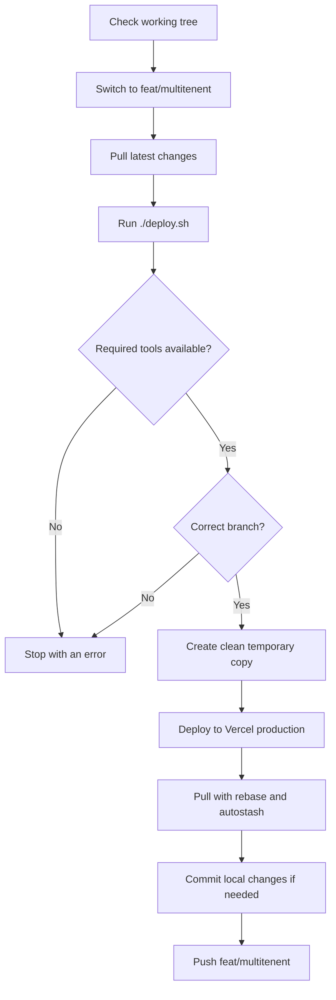

<div align="center">

# Inspection hancod

### Inspection management platform built with Next.js

A modern web application for inspection workflows, dashboards, transactions, certificates, and business operations.

[](https://nextjs.org/)
[](https://react.dev/)
[](https://www.typescriptlang.org/)
[](https://supabase.com/)

</div>

## Contents

- [Overview](#overview)
- [Requirements](#requirements)
- [Quick start](#quick-start)
- [Available commands](#available-commands)
- [Docker](#docker)
- [Production deployment](#production-deployment)
- [Git workflow](#git-workflow)
- [Project structure](#project-structure)
- [Security](#security)

## Overview

Inspection hancod is a Next.js application that provides tools for managing inspection-related data and operations. The application uses TypeScript, React, Tailwind CSS, Supabase, and a collection of reusable UI and service modules.

| Area | Technology |
| --- | --- |
| Framework | Next.js 14 |
| Language | TypeScript |
| UI | React, Tailwind CSS, Radix UI, Material UI |
| Data and authentication | Supabase |
| State management | Redux Toolkit |
| Production hosting | Vercel |

## Requirements

Install the following before starting:

| Requirement | Purpose |
| --- | --- |
| Node.js 18+ | Run and build the Next.js application |
| npm | Install dependencies and run scripts |
| Git | Version control and deployment synchronization |
| Vercel CLI | Required by `deploy.sh` |
| `rsync` | Required by `deploy.sh` |
| Docker Desktop | Optional; only needed for the Docker workflow |

## Quick start

### 1. Clone the repository

```bash
git clone <repository-url>
cd qube-inspection
```

### 2. Install dependencies

```bash
npm install
```

For CI or a clean lockfile-based install, use:

```bash
npm ci
```

### 3. Configure environment variables

Create or update `.env.local` with the required local environment variables.

If the repository provides an example file, copy it first:

```bash
cp .env.example .env.local
```

> Keep environment files and secrets private. Never commit API keys, database passwords, service-role keys, or Vercel tokens.

### 4. Start the development server

```bash
npm run dev
```

Then open [http://localhost:3000](http://localhost:3000).

## Available commands

| Command | Description |
| --- | --- |
| `npm run dev` | Start the development server |
| `npm run lint` | Run Next.js lint checks |
| `npm run build` | Create a production build |
| `npm run start` | Serve the production build locally |
| `npm ci` | Install the exact dependency versions from `package-lock.json` |

Run the standard local verification before deployment:

```bash
npm run lint
npm run build
npm run start
```

## Docker

> **Current status:** This repository does not currently contain a `Dockerfile` or `docker-compose.yml`. The commands below are ready to use once the corresponding Docker configuration is added.

### Build and run

```bash
docker build -t inspection-hancod .
docker run --rm -p 3000:3000 --env-file .env.local inspection-hancod
```

Open [http://localhost:3000](http://localhost:3000) after the container starts.

### Docker reference

| Command | Purpose |
| --- | --- |
| `docker ps` | List running containers |
| `docker ps -a` | List all containers |
| `docker images` | List local images |
| `docker logs -f <container-id>` | Follow container logs |
| `docker stop <container-id>` | Stop a running container |
| `docker system df` | Check Docker disk usage |

### Docker Compose

If a Compose file is added later:

```bash
docker compose up --build
docker compose up -d --build
docker compose logs -f
docker compose down
```

Do not bake production secrets into a Docker image. Use environment variables or your hosting platform's secret manager.

## Production deployment

### `deploy.sh`

The `deploy.sh` script is the project's repeatable production deployment and Git synchronization workflow. It is important because it:

- Ensures deployment runs from the expected `feat/multitenent` branch.
- Creates a clean temporary deployment copy.
- Excludes Git data, dependencies, build output, and environment files.
- Deploys the copy to the configured Vercel production project.
- Pulls the latest branch changes with rebase and autostash.
- Stages, commits, and pushes local changes when required.

### Deployment flow



### Before deployment

Review changes before running the script because it performs Git operations automatically:

```bash
vercel login
git status
git diff
git switch feat/multitenent
git pull --rebase origin feat/multitenent
chmod +x deploy.sh
./deploy.sh
```

> **Important:** `deploy.sh` runs `git add -A`, may create a commit using its configured commit message, and pushes to `origin/feat/multitenent`. Review your working tree before executing it.

The deployment target, Vercel scope, branch, and commit message are configured at the top of `deploy.sh`. Update them if the deployment environment changes.

## Git workflow

### Inspect the repository

```bash
git status
git branch --show-current
git log --oneline --decorate -10
```

### Create and publish a feature branch

```bash
git switch -c feature/<short-description>
git push -u origin feature/<short-description>
```

### Commit changes

```bash
git add <file>
git diff --cached
git commit -m "feat: describe the change"
```

### Synchronize with the remote

```bash
git pull --rebase origin <branch-name>
git push origin <branch-name>
```

### Review changes

```bash
git diff
git diff --cached
git diff HEAD~1
```

### Resolve rebase conflicts

```bash
git status
# Resolve the conflicted files, then:
git add <resolved-file>
git rebase --continue
```

## Project structure

```text
.
├── src/
│   ├── app/          # Next.js routes, layouts, and pages
│   ├── components/   # Reusable UI components
│   ├── context/      # React context providers
│   ├── hooks/        # Reusable React hooks
│   ├── lib/          # Shared utilities and configuration
│   ├── redux/        # Redux state management
│   └── services/     # API and service integrations
├── public/           # Static assets and certificate resources
├── supabase/         # Migrations, functions, and configuration
├── deploy.sh         # Vercel deployment and Git synchronization
├── package.json      # Scripts and dependencies
└── package-lock.json # Locked dependency versions
```

## Security

- Keep `.env`, `.env.local`, and other environment files out of commits.
- Never expose Supabase service-role keys or other server-side credentials in client-side code.
- Verify the target branch and Vercel project before running `deploy.sh`.
- Use `npm ci` in CI environments to install the committed dependency versions.
- Review `git diff` before committing or deploying.

<div align="center">

Made for reliable inspection operations.

</div>
